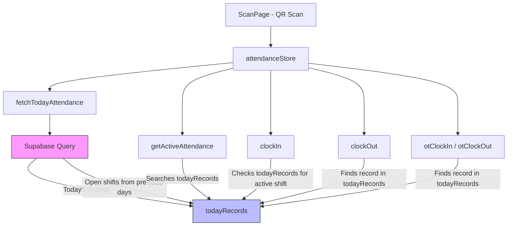

# Design Document: Overnight Shift Fix

## Overview

This fix addresses the cross-midnight shift bug in the attendance management system. The root cause is that `fetchTodayAttendance()` only queries records where `clock_in` falls within today's date range. After midnight, shifts that started the previous day are excluded from `todayRecords`, causing all downstream functions (`getActiveAttendance`, `clockIn`, `clockOut`, `otClockIn`, `otClockOut`) to fail for overnight workers.

The fix is minimal and surgical: modify the Supabase query in `fetchTodayAttendance()` to also fetch open shifts from previous days, and ensure all functions that search `todayRecords` can find these cross-day records. No database schema changes are needed — `differenceInMinutes` from `date-fns` already handles cross-midnight timestamp math correctly.

## Architecture

The fix is contained entirely within the frontend layer. No backend/database schema changes are required.



The key change is in the Supabase query (pink node): it now returns the union of today's records AND any open shifts from previous days. All downstream consumers already search `todayRecords`, so they automatically gain visibility into overnight shifts.

## Components and Interfaces

### Modified Component: `fetchTodayAttendance()`

**Current behavior**: Queries attendance records where `clock_in` is between `startOfDay(today)` and `endOfDay(today)`.

**New behavior**: Executes two queries (or a single query with an OR condition) to fetch:
1. All records where `clock_in` is within today's date range (existing behavior)
2. All records where `status = 'clocked_in'` regardless of `clock_in` date (new — catches overnight shifts)

The results are merged, deduplicated by `id`, and stored in `todayRecords`.

```typescript
fetchTodayAttendance: async () => {
  set({ isLoading: true, error: null });
  try {
    const today = new Date();

    // Query 1: Today's records (existing behavior)
    const { data: todayData, error: todayError } = await supabase
      .from('attendance')
      .select('*, worker:workers(*)')
      .gte('clock_in', startOfDay(today).toISOString())
      .lte('clock_in', endOfDay(today).toISOString())
      .order('clock_in', { ascending: false });

    if (todayError) throw todayError;

    // Query 2: Open shifts from any day
    const { data: openData, error: openError } = await supabase
      .from('attendance')
      .select('*, worker:workers(*)')
      .eq('status', 'clocked_in')
      .order('clock_in', { ascending: false });

    if (openError) throw openError;

    // Merge and deduplicate
    const allRecords = todayData || [];
    const todayIds = new Set(allRecords.map(r => r.id));
    for (const record of (openData || [])) {
      if (!todayIds.has(record.id)) {
        allRecords.push(record);
      }
    }

    set({ todayRecords: allRecords, isLoading: false });
  } catch (error) {
    const message = error instanceof Error ? error.message : 'An error occurred';
    set({ error: message, isLoading: false });
  }
}
```

### Unchanged Components (no code changes needed)

- **`getActiveAttendance(workerId)`**: Already searches `todayRecords` for `status === 'clocked_in'`. Once overnight records are in `todayRecords`, this works automatically.
- **`clockIn(workerId, scannedBy)`**: Already checks `todayRecords` for existing active records. Once overnight records are in `todayRecords`, duplicate prevention works automatically.
- **`clockOut(attendanceId)`**: Already finds the record by `id` in `todayRecords`. Once overnight records are in `todayRecords`, this works automatically. The `differenceInMinutes` calculation already handles cross-midnight correctly.
- **`otClockIn(workerId)`**: Already searches `todayRecords` by `worker_id`. Works automatically once overnight records are present.
- **`otClockOut(workerId)`**: Already searches `todayRecords` for active OT sessions. Works automatically once overnight records are present.
- **`ScanPage.tsx`**: The "Currently Working" sidebar already filters `todayRecords` by `status === 'clocked_in'`. No changes needed — overnight workers will appear automatically.
- **`markCompletedByQuota(attendanceId, ...)`**: Already finds by `id` in `todayRecords`. Works automatically.

### Deduplication Logic

The merge function ensures no record appears twice in `todayRecords`. This handles the case where a shift starts today and is still open — it would appear in both query results.

```typescript
function mergeRecords(
  todayData: AttendanceWithWorker[],
  openData: AttendanceWithWorker[]
): AttendanceWithWorker[] {
  const merged = [...todayData];
  const existingIds = new Set(todayData.map(r => r.id));
  for (const record of openData) {
    if (!existingIds.has(record.id)) {
      merged.push(record);
    }
  }
  return merged;
}
```

## Data Models

No changes to the database schema or TypeScript types are required. The existing `Attendance` type and `AttendanceWithWorker` type already support all the fields needed.

The `todayRecords` array in the Zustand store will now contain a superset of what it previously held:
- **Before**: Records where `clock_in` is within today's date range
- **After**: Records where `clock_in` is within today's date range OR `status = 'clocked_in'` (open shifts from any day)

This is a backward-compatible change — all existing consumers that filter `todayRecords` by status or worker_id continue to work correctly.


## Correctness Properties

*A property is a characteristic or behavior that should hold true across all valid executions of a system — essentially, a formal statement about what the system should do. Properties serve as the bridge between human-readable specifications and machine-verifiable correctness guarantees.*

### Property 1: Open shifts are always included in fetched records

*For any* set of attendance records in the database, after `fetchTodayAttendance()` completes, `todayRecords` SHALL contain every record with `status = 'clocked_in'`, regardless of the `clock_in` date.

**Validates: Requirements 1.1**

### Property 2: Merged records contain no duplicates

*For any* two arrays of attendance records (today's records and open shift records) that may share common records, the merge operation SHALL produce an array where every record `id` appears exactly once.

**Validates: Requirements 1.2**

### Property 3: No worker has simultaneous active shifts

*For any* worker and any state of `todayRecords`, if the worker already has a record with `status = 'clocked_in'` in `todayRecords`, then calling `clockIn` for that worker SHALL fail (throw an error) and SHALL NOT create a new record.

**Validates: Requirements 3.1**

### Property 4: Hours worked calculation is correct and capped

*For any* pair of `clock_in` and `clock_out` timestamps (including cross-midnight pairs), the computed `hours_worked` SHALL equal `min(differenceInMinutes(clock_out, clock_in) / 60, 8)` rounded to two decimal places.

**Validates: Requirements 4.2**

## Error Handling

The fix does not introduce new error states. Existing error handling covers all scenarios:

- **Supabase query failure**: Both the today-records query and the open-shifts query are wrapped in try/catch. If either fails, the error is set in the store and `isLoading` is reset to `false`.
- **Record not found in clockOut**: If `todayRecords.find()` returns `undefined`, the existing `throw new Error('Attendance record not found')` handles it. With the fix, this should no longer happen for overnight shifts since they are now in `todayRecords`.
- **Duplicate clock-in attempt**: The existing `throw new Error('Worker is already clocked in')` handles this. With the fix, this correctly fires for overnight workers too.
- **OT without active shift**: The existing error messages in `otClockIn` and `otClockOut` remain unchanged.

## Testing Strategy

### Testing Framework

Since this is a Vite + React + TypeScript project with no existing test framework, we will use:
- **Vitest** for unit and property-based tests (native Vite integration)
- **fast-check** for property-based testing (the standard PBT library for TypeScript)

### Unit Tests

Unit tests should cover specific examples and edge cases:
- A worker clocks in at 3 PM, the system fetches records at 1 AM the next day — the open shift appears in `todayRecords`
- Merging two arrays with overlapping records produces no duplicates
- Merging two arrays with no overlap produces the union
- Clock-out at 2 AM for a 3 PM clock-in calculates 11 hours but caps at 8
- Clock-out at 6 PM for a 10 AM clock-in calculates 8 hours (exactly at cap)
- OT clock-in/out works for a record that started the previous day

### Property-Based Tests

Each correctness property maps to a single property-based test with minimum 100 iterations:

- **Feature: overnight-shift-fix, Property 1: Open shifts always included** — Generate random attendance records with various dates and statuses, simulate the merge logic, verify all `clocked_in` records are present.
- **Feature: overnight-shift-fix, Property 2: No duplicate IDs after merge** — Generate random overlapping arrays of records, merge them, verify all IDs are unique.
- **Feature: overnight-shift-fix, Property 3: No simultaneous active shifts** — Generate a todayRecords array containing an active shift for a worker, attempt clockIn, verify it fails.
- **Feature: overnight-shift-fix, Property 4: Hours capped at 8** — Generate random clock_in/clock_out timestamp pairs, compute hours, verify the result matches `min(actual, 8)`.

### Test Configuration

```typescript
// vitest.config.ts
import { defineConfig } from 'vitest/config';

export default defineConfig({
  test: {
    globals: true,
    environment: 'node',
  },
});
```

Each property test should run with `{ numRuns: 100 }` minimum via fast-check.
