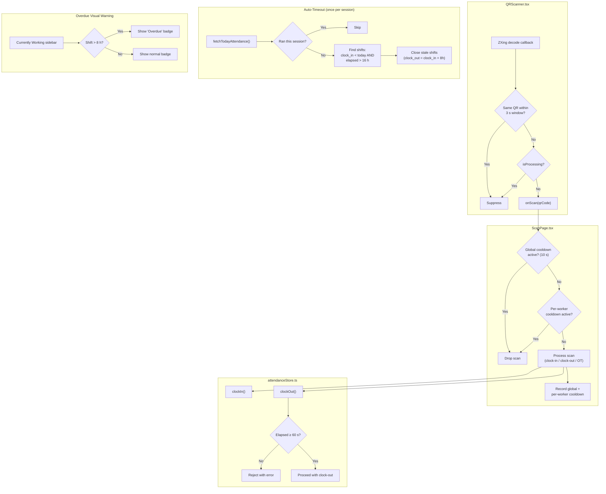

# Design Document

## Overview

This design hardens the Macrock Limestone attendance scan pipeline against double-fire bugs and fixes the overly aggressive auto-timeout logic that was silently closing legitimate overnight shifts. All changes are frontend-only (React components + Zustand store) — no database schema changes, no Supabase migrations, and full backward compatibility with existing payroll.

The solution introduces three layers of scan protection:

1. **Frame-level debounce** inside `QRScanner.tsx` — suppresses repeated ZXing decode callbacks for the same QR value within a configurable window (3 s default).
2. **Global + per-worker cooldown** in `ScanPage.tsx` — blocks all scans for 10 s after any successful action, and additionally tracks per-worker cooldowns as defense-in-depth.
3. **Minimum shift duration guard** in `attendanceStore.ts` — rejects clock-outs where elapsed time since clock-in is < 60 s.

For auto-timeout, the current two-stage approach (stale-shift close + 8h15m same-day auto-close) is replaced with a single, safer strategy:

- Stale shifts are only auto-closed when `clock_in` is on a previous calendar day **and** elapsed time exceeds 16 hours.
- The 8h15m same-day auto-close is removed entirely and replaced with a visual "Overdue" badge in the sidebar.

## Architecture



The architecture preserves the existing unidirectional data flow: `QRScanner → ScanPage → attendanceStore → Supabase`. Each layer adds its own protection without coupling to the others.

## Components and Interfaces

### QRScanner Component Changes

**File:** `src/components/qr/QRScanner.tsx`

Add an internal debounce mechanism using a ref to track the last decoded QR value and timestamp:

```typescript
interface QRScannerProps {
  onScan: (result: string) => void;
  isProcessing?: boolean;
  autoStart?: boolean;
  debounceMs?: number; // New prop, default 3000
}
```

Internal state (refs, not React state to avoid re-renders):
- `lastDecodeRef: { value: string; time: number } | null` — tracks the last QR value and decode timestamp.

Debounce logic lives inside the ZXing decode callback:
1. If `isProcessing` is true → suppress.
2. If decoded value equals `lastDecodeRef.value` AND `Date.now() - lastDecodeRef.time < debounceMs` → suppress.
3. Otherwise → update `lastDecodeRef`, call `onScan(value)`.

### ScanPage Changes

**File:** `src/pages/ScanPage.tsx`

Replace the existing `lastScanRef` / `lastActionRef` with:

- `lastActionTimeRef: React.MutableRefObject<number>` — timestamp of last successful action (global cooldown). Default: `0`.
- `workerCooldownMap: React.MutableRefObject<Map<string, number>>` — maps `worker_id → timestamp` of last successful action for that worker.

Constants:
```typescript
const ACTION_COOLDOWN_MS = 10_000; // 10 seconds
```

`handleScan` flow:
1. If `isProcessing` → return.
2. If `Date.now() - lastActionTimeRef.current < ACTION_COOLDOWN_MS` → return (global cooldown).
3. Look up worker from QR code.
4. If worker found, check `workerCooldownMap.get(worker.id)` — if within cooldown → return.
5. Process the scan (clock-in, clock-out, OT).
6. On success: set `lastActionTimeRef.current = Date.now()` and `workerCooldownMap.set(worker.id, Date.now())`.

Overdue badge in the "Currently Working" sidebar:
- For each `clocked_in` record, compute `differenceInMinutes(now, clock_in)`.
- If ≥ 480 minutes (8 hours), render a `<Badge variant="danger">Overdue</Badge>` next to the worker.

### AttendanceStore Changes

**File:** `src/stores/attendanceStore.ts`

#### Auto-Timeout Rewrite

Replace both the stale-shift auto-close and the 8h15m auto-close with a single block:

```typescript
const STALE_SHIFT_THRESHOLD_HOURS = 16;
```

Logic (inside `fetchTodayAttendance`, guarded by `autoTimeoutRanThisSession`):
1. Find all open shifts (`status = 'clocked_in'`) where:
   - `clock_in` is before `startOfDay(today)` (not today), AND
   - `Date.now() - clock_in > 16 hours`
2. For each stale shift, update:
   - `clock_out` = `clock_in + 8 hours`
   - `hours_worked` = 8
   - `status` = `'clocked_out'`
   - `notes` = `"Auto-timed out (forgot to clock out)" | existing notes`
   - If `ot_clock_in` set and `ot_clock_out` null → set `ot_clock_out` = same `clock_out`
3. Wrap each update in try/catch — log errors, continue with remaining shifts.
4. Set `autoTimeoutRanThisSession = true`.

#### Remove 8h15m Auto-Close

Delete the entire block that checks `autoCloseThresholdMinutes = 8 * 60 + 15` and auto-closes overdue records. This is replaced by the visual "Overdue" badge in ScanPage.

#### Minimum Shift Duration Guard

In `clockOut()`, after the existing 1-minute check, update the threshold:

```typescript
const MINIMUM_SHIFT_DURATION_SECONDS = 60;
```

The existing check already rejects clock-outs within 1 minute (`minutesWorked < 1`). We refine this to use seconds for precision:

```typescript
const elapsedSeconds = (clockOut.getTime() - clockIn.getTime()) / 1000;
if (elapsedSeconds < MINIMUM_SHIFT_DURATION_SECONDS) {
  throw new Error('Cannot clock out within 60 seconds of clocking in. Please try again later.');
}
```

## Data Models

No database schema changes. All new state is ephemeral (React refs, module-level flags):

| State | Location | Type | Lifetime |
|-------|----------|------|----------|
| `lastDecodeRef` | QRScanner ref | `{ value: string; time: number } \| null` | Component mount |
| `lastActionTimeRef` | ScanPage ref | `number` | Component mount |
| `workerCooldownMap` | ScanPage ref | `Map<string, number>` | Component mount |
| `autoTimeoutRanThisSession` | Module-level variable | `boolean` | Browser session |

Existing database types (`Attendance`, `AttendanceWithWorker`, `Worker`) remain unchanged. The `attendance` table schema is untouched — `clock_in`, `clock_out`, `hours_worked`, `overtime_hours`, `status`, `notes`, `ot_clock_in`, `ot_clock_out` all retain their current types and constraints.

## Correctness Properties

*A property is a characteristic or behavior that should hold true across all valid executions of a system — essentially, a formal statement about what the system should do. Properties serve as the bridge between human-readable specifications and machine-verifiable correctness guarantees.*

### Property 1: Debounce fires if and only if value changed or window expired

*For any* sequence of QR decode events (each with a QR string value and a timestamp), the debounce function SHALL invoke `onScan` if and only if the decoded value differs from the immediately preceding decoded value, OR the time elapsed since the preceding decode of the same value is greater than or equal to the `debounceMs` window.

**Validates: Requirements 1.1, 1.2, 1.3**

### Property 2: isProcessing suppresses all callbacks

*For any* QR decode event (any QR value, any timing, any debounce state), when `isProcessing` is `true`, the debounce function SHALL NOT invoke `onScan`.

**Validates: Requirements 1.4**

### Property 3: Global cooldown gates scan acceptance

*For any* scan event arriving at time `t`, and a last successful action at time `tLast`, the scan SHALL be accepted if and only if `t - tLast >= ACTION_COOLDOWN_MS`. When `t - tLast < ACTION_COOLDOWN_MS`, the scan SHALL be dropped.

**Validates: Requirements 2.2, 2.3**

### Property 4: Minimum shift duration guards clock-out

*For any* attendance record with `clock_in` timestamp and a clock-out attempt at time `now`, the `clockOut` operation SHALL succeed if and only if `now - clock_in >= MINIMUM_SHIFT_DURATION_SECONDS` (60 s). When the elapsed time is less than 60 seconds, the operation SHALL reject with an error.

**Validates: Requirements 3.1, 3.2, 3.3**

### Property 5: Stale shift identification

*For any* open attendance record (status = `clocked_in`), the auto-timeout process SHALL classify it as stale if and only if `clock_in` is before the start of the current calendar day AND the elapsed time since `clock_in` exceeds 16 hours. Records where `clock_in` falls within the current calendar day SHALL never be classified as stale, regardless of elapsed time.

**Validates: Requirements 4.3, 4.4, 5.1, 5.2**

### Property 6: Auto-timeout payload correctness

*For any* shift classified as stale, the auto-timeout update payload SHALL set `clock_out` to exactly `clock_in + 8 hours`, `hours_worked` to `8`, `status` to `'clocked_out'`, and `notes` SHALL contain the text `"Auto-timed out (forgot to clock out)"`. Additionally, if the shift has `ot_clock_in` set and `ot_clock_out` is null, the payload SHALL set `ot_clock_out` to the same value as `clock_out`.

**Validates: Requirements 4.5, 4.6**

## Error Handling

| Scenario | Handling |
|----------|----------|
| QR code not found in worker list | Show error message "Worker not found. Invalid QR code." — no cooldown recorded |
| Clock-out within 60 s of clock-in | `clockOut()` throws descriptive error, store sets `error` state, ScanPage displays it |
| Supabase error during auto-timeout of one shift | Catch error, `console.error` it, continue processing remaining stale shifts |
| Supabase error during clock-in/clock-out | Existing error handling preserved — store sets `error`, UI displays it |
| Camera permission denied | Existing QRScanner error handling preserved — shows error message |
| Worker already clocked in (duplicate clock-in attempt) | Existing guard in `clockIn()` throws "Worker is already clocked in" |

Key principle: auto-timeout errors are non-fatal (log and continue), while user-facing operations (clock-in, clock-out) surface errors to the UI.

## Testing Strategy

### Property-Based Tests (fast-check + Vitest)

Each correctness property maps to a single property-based test with ≥ 100 iterations. The debounce, cooldown, stale-shift filter, and auto-timeout payload logic will be extracted into pure functions to enable direct property testing without React component mounting or Supabase mocking.

**Pure functions to extract for testing:**

1. `shouldFireOnScan(current: { value: string; time: number }, previous: { value: string; time: number } | null, debounceMs: number, isProcessing: boolean): boolean` — encapsulates Properties 1 and 2.
2. `isScanAllowed(now: number, lastActionTime: number, cooldownMs: number): boolean` — encapsulates Property 3.
3. `isShiftDurationValid(clockInTime: number, nowTime: number, minDurationSeconds: number): boolean` — encapsulates Property 4.
4. `isShiftStale(clockIn: Date, now: Date, todayStart: Date, thresholdHours: number): boolean` — encapsulates Property 5.
5. `buildAutoTimeoutPayload(clockIn: Date, existingNotes: string | null, hasOpenOT: boolean): object` — encapsulates Property 6.

**Test configuration:**
- Library: `fast-check` (already installed)
- Runner: `vitest` (already configured)
- Minimum iterations: 100 per property
- Tag format: `Feature: shift-aware-attendance, Property N: <title>`

### Unit Tests (example-based)

- Overdue badge: verify `differenceInMinutes(now, clockIn) >= 480` triggers the badge (Requirement 5.3)
- Per-worker cooldown: verify a second scan for the same worker within cooldown is rejected, while a different worker is accepted (Requirements 6.2, 6.3)
- Auto-timeout session flag: verify auto-timeout runs exactly once per session (Requirements 4.1, 4.2)
- Backward compatibility: run existing `hoursWorkedCapped` and `mergeAttendanceRecords` property tests to confirm no regression (Requirement 7.2)

### Integration Tests

- Auto-timeout error resilience: mock Supabase to fail on one shift, verify remaining shifts are processed (Requirement 4.7)
- End-to-end scan flow: mock Supabase, simulate QR scan → clock-in → rapid re-scan → verify second scan is blocked (Requirements 1–3 combined)

