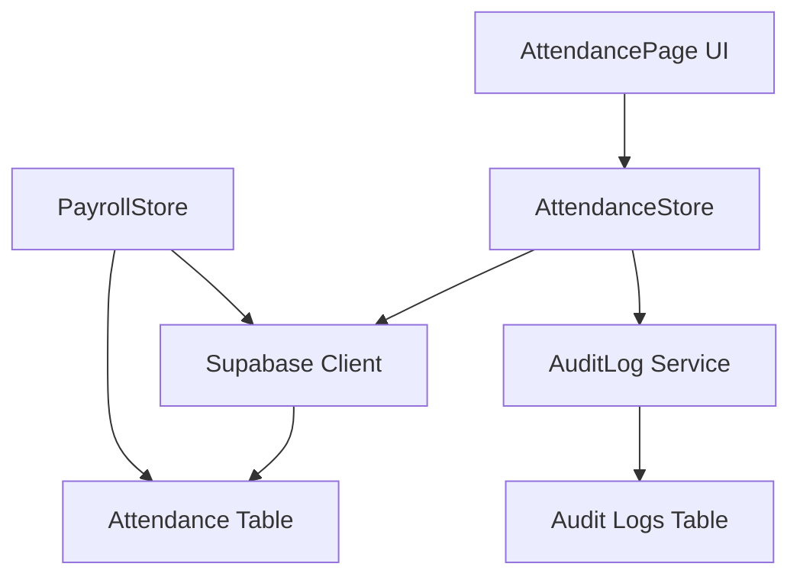
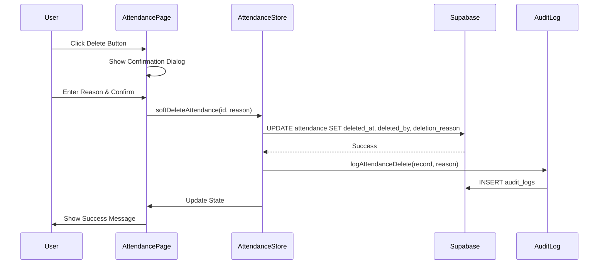

# Design Document: Soft Delete Attendance Records

## Overview

This design implements soft-delete functionality for attendance records in the attendance management system. The feature allows administrators to mark accidental attendance scans as deleted without permanently removing them from the database. Soft-deleted records are excluded from attendance calculations and payroll processing while remaining available in audit logs for tracking and compliance purposes.

### Key Design Decisions

1. **Soft Delete Pattern**: Use timestamp-based soft delete (`deleted_at`) rather than boolean flags to capture when deletion occurred
2. **Audit Trail**: Maintain complete deletion metadata (`deleted_by`, `deletion_reason`) for compliance
3. **Query Filtering**: Apply soft delete filters at the query level rather than database views to maintain flexibility
4. **UI Integration**: Add delete functionality directly to the existing attendance table with confirmation workflow
5. **Referential Integrity**: Preserve all foreign key relationships for deleted records

### Technology Stack

- **Frontend**: React with TypeScript, Zustand for state management
- **Backend**: Supabase (PostgreSQL)
- **UI Components**: Existing component library (Modal, Button)
- **Audit System**: Existing audit log infrastructure

## Architecture

### System Components



### Data Flow for Soft Delete Operation



### Query Filtering Strategy

All attendance queries will be modified to exclude soft-deleted records by adding a filter condition:

```typescript
.is('deleted_at', null)
```

This approach:
- Maintains query flexibility
- Allows easy access to deleted records when needed (e.g., audit reports)
- Avoids database view complexity
- Keeps business logic in application layer

## Components and Interfaces

### Database Schema Changes

#### Attendance Table Modifications

Add three new columns to the `attendance` table:

```sql
ALTER TABLE attendance
ADD COLUMN deleted_at TIMESTAMPTZ DEFAULT NULL,
ADD COLUMN deleted_by UUID REFERENCES users(id) DEFAULT NULL,
ADD COLUMN deletion_reason TEXT DEFAULT NULL;

CREATE INDEX idx_attendance_deleted_at ON attendance(deleted_at);
```

**Field Specifications:**

- `deleted_at`: TIMESTAMPTZ, nullable
  - NULL = record is active
  - Non-NULL = record is soft-deleted, value indicates deletion timestamp
  
- `deleted_by`: UUID, nullable, foreign key to `users.id`
  - Stores the user ID who performed the deletion
  - Enables accountability and audit trail
  
- `deletion_reason`: TEXT, nullable
  - Stores the reason provided by the admin
  - Validated: 10-500 characters
  - Required for all deletions

**Index Rationale:**
- Index on `deleted_at` optimizes the common query pattern: `WHERE deleted_at IS NULL`
- Improves performance for attendance list queries and payroll calculations

### TypeScript Type Definitions

Update `src/types/database.ts`:

```typescript
export interface Database {
  public: {
    Tables: {
      attendance: {
        Row: {
          // ... existing fields
          deleted_at: string | null;
          deleted_by: string | null;
          deletion_reason: string | null;
        };
        Insert: {
          // ... existing fields
          deleted_at?: string | null;
          deleted_by?: string | null;
          deletion_reason?: string | null;
        };
        Update: {
          // ... existing fields
          deleted_at?: string | null;
          deleted_by?: string | null;
          deletion_reason?: string | null;
        };
      };
    };
  };
}
```

### UI Components

#### Delete Button Component

Add delete button to the attendance table row actions (admin only):

```typescript
// In AttendancePage.tsx, within the table row
{isAdmin && (
  <td className="px-6 py-4 whitespace-nowrap text-sm">
    <button
      onClick={() => handleDeleteRecord(record)}
      className="text-red-600 hover:text-red-800 flex items-center gap-1"
      disabled={!!record.deleted_at}
    >
      <Trash2 className="w-4 h-4" />
      Delete
    </button>
  </td>
)}
```

**Design Considerations:**
- Only visible to admin users (`user.role === 'admin'`)
- Disabled if record is already deleted
- Uses red color scheme to indicate destructive action
- Icon + text for clarity

#### Confirmation Dialog Component

Create a new confirmation dialog for deletion:

```typescript
interface DeleteConfirmationDialogProps {
  isOpen: boolean;
  record: AttendanceWithWorker | null;
  onConfirm: (reason: string) => void;
  onCancel: () => void;
  isDeleting: boolean;
}

const DeleteConfirmationDialog: React.FC<DeleteConfirmationDialogProps> = ({
  isOpen,
  record,
  onConfirm,
  onCancel,
  isDeleting
}) => {
  const [reason, setReason] = useState('');
  const [error, setError] = useState('');

  const handleConfirm = () => {
    // Validation
    const trimmedReason = reason.trim();
    if (trimmedReason.length < 10) {
      setError('Reason must be at least 10 characters');
      return;
    }
    if (trimmedReason.length > 500) {
      setError('Reason must not exceed 500 characters');
      return;
    }
    
    onConfirm(trimmedReason);
  };

  return (
    <Modal isOpen={isOpen} onClose={onCancel} title="Delete Attendance Record">
      {/* Dialog content */}
    </Modal>
  );
};
```

**Dialog Features:**
- Displays worker name and attendance details
- Requires deletion reason (10-500 characters)
- Real-time validation feedback
- Character counter
- Confirm/Cancel actions
- Loading state during deletion

### Service Layer

#### AttendanceStore Modifications

Add new method to `src/stores/attendanceStore.ts`:

```typescript
interface AttendanceState {
  // ... existing properties
  softDeleteAttendance: (attendanceId: string, reason: string) => Promise<void>;
}

// Implementation
softDeleteAttendance: async (attendanceId: string, reason: string) => {
  set({ isLoading: true, error: null });
  try {
    // Get current user
    const { data: { user } } = await supabase.auth.getUser();
    if (!user) throw new Error('User not authenticated');

    // Fetch the record to check if already deleted
    const { data: existingRecord, error: fetchError } = await supabase
      .from('attendance')
      .select('*, worker:workers(*)')
      .eq('id', attendanceId)
      .single();

    if (fetchError) throw fetchError;
    if (!existingRecord) throw new Error('Attendance record not found');
    
    // Prevent deletion of already deleted records
    if (existingRecord.deleted_at) {
      throw new Error('This record has already been deleted');
    }

    // Perform soft delete
    const { error: updateError } = await supabase
      .from('attendance')
      .update({
        deleted_at: new Date().toISOString(),
        deleted_by: user.id,
        deletion_reason: reason.trim()
      })
      .eq('id', attendanceId);

    if (updateError) throw updateError;

    // Log to audit system
    await auditLog.logAttendanceDelete(
      existingRecord.worker_id,
      existingRecord.worker?.full_name || 'Unknown',
      existingRecord.clock_in,
      existingRecord.clock_out,
      reason.trim()
    );

    // Remove from local state
    set((state) => ({
      todayRecords: state.todayRecords.filter((r) => r.id !== attendanceId),
      attendanceRecords: state.attendanceRecords.filter((r) => r.id !== attendanceId),
      isLoading: false
    }));
  } catch (error) {
    const message = error instanceof Error ? error.message : 'An error occurred';
    set({ error: message, isLoading: false });
    throw error;
  }
}
```

#### Query Modifications

Update all attendance queries to exclude soft-deleted records:

**1. fetchAttendance (date range queries)**

```typescript
fetchAttendance: async (startDate?: Date, endDate?: Date) => {
  // ... existing code
  let query = supabase
    .from('attendance')
    .select(`*, worker:workers(*)`)
    .is('deleted_at', null)  // ADD THIS LINE
    .order('clock_in', { ascending: false });
  // ... rest of implementation
}
```

**2. fetchTodayAttendance**

```typescript
fetchTodayAttendance: async () => {
  // ... existing code
  
  // Query 1: Today's records
  const { data: todayData, error: todayError } = await supabase
    .from('attendance')
    .select(`*, worker:workers(*)`)
    .gte('clock_in', startOfDay(today).toISOString())
    .lte('clock_in', endOfDay(today).toISOString())
    .is('deleted_at', null)  // ADD THIS LINE
    .order('clock_in', { ascending: false });

  // Query 2: Open shifts
  const { data: openData, error: openError } = await supabase
    .from('attendance')
    .select(`*, worker:workers(*)`)
    .eq('status', 'clocked_in')
    .is('deleted_at', null)  // ADD THIS LINE
    .order('clock_in', { ascending: false });
  
  // ... rest of implementation
}
```

**3. Worker-specific attendance queries (in AttendancePage.tsx)**

```typescript
const handleWorkerSelect = async (workerId: string) => {
  // ... existing code
  const { data, error } = await supabase
    .from('attendance')
    .select(`*, worker:workers(*)`)
    .eq('worker_id', workerId)
    .is('deleted_at', null)  // ADD THIS LINE
    .order('clock_in', { ascending: false });
  // ... rest of implementation
}
```

#### PayrollStore Modifications

Update payroll calculation to exclude soft-deleted records:

```typescript
generatePayroll: async (periodStart: Date, periodEnd: Date) => {
  // ... existing code
  
  const { data: attendance, error: attendanceError } = await supabase
    .from('attendance')
    .select('*')
    .gte('clock_in', startOfDay(periodStart).toISOString())
    .lte('clock_in', endOfDay(periodEnd).toISOString())
    .in('status', ['clocked_out', 'completed_quota'])
    .is('deleted_at', null);  // ADD THIS LINE
  
  // ... rest of implementation
}
```

### Audit Logging Integration

Add new audit log method to `src/lib/auditLog.ts`:

```typescript
async logAttendanceDelete(
  workerId: string,
  workerName: string,
  clockIn: string,
  clockOut: string | null,
  reason: string
): Promise<void> {
  await this.log({
    action: 'DELETE',
    category: 'ATTENDANCE',
    description: `Deleted attendance record for ${workerName}: ${reason}`,
    entityType: 'attendance',
    entityId: workerId,
    entityName: workerName,
    oldValues: {
      clock_in: clockIn,
      clock_out: clockOut
    },
    metadata: {
      deletion_reason: reason
    },
    severity: 'WARNING'
  });
}
```

**Audit Log Entry Structure:**
- **action**: 'DELETE'
- **category**: 'ATTENDANCE'
- **severity**: 'WARNING' (deletion is a significant action)
- **description**: Human-readable summary
- **oldValues**: Original clock-in/clock-out times
- **metadata**: Deletion reason for searchability

## Data Models

### Attendance Record (Extended)

```typescript
interface Attendance {
  // Existing fields
  id: string;
  worker_id: string;
  clock_in: string;
  clock_out: string | null;
  hours_worked: number | null;
  overtime_hours: number | null;
  status: 'clocked_in' | 'clocked_out' | 'completed_quota';
  // ... other existing fields
  
  // New soft delete fields
  deleted_at: string | null;
  deleted_by: string | null;
  deletion_reason: string | null;
}
```

### Deletion Validation Rules

```typescript
interface DeletionValidation {
  reason: string;
  
  validate(): ValidationResult {
    const trimmed = this.reason.trim();
    
    if (trimmed.length < 10) {
      return {
        valid: false,
        error: 'Deletion reason must be at least 10 characters'
      };
    }
    
    if (trimmed.length > 500) {
      return {
        valid: false,
        error: 'Deletion reason must not exceed 500 characters'
      };
    }
    
    return { valid: true };
  }
}
```

## Error Handling

### Error Scenarios and Responses

| Scenario | Error Message | HTTP Status | User Action |
|----------|---------------|-------------|-------------|
| Record not found | "Attendance record not found" | 404 | Refresh page |
| Already deleted | "This record has already been deleted" | 400 | Dismiss dialog |
| Reason too short | "Deletion reason must be at least 10 characters" | 400 | Enter longer reason |
| Reason too long | "Deletion reason must not exceed 500 characters" | 400 | Shorten reason |
| Not authenticated | "User not authenticated" | 401 | Re-login |
| Not authorized | "Only administrators can delete records" | 403 | Contact admin |
| Database error | "Failed to delete record: [error details]" | 500 | Retry or contact support |

### Error Handling Implementation

```typescript
// In AttendancePage.tsx
const handleDeleteConfirm = async (reason: string) => {
  try {
    setIsDeleting(true);
    await softDeleteAttendance(recordToDelete!.id, reason);
    
    // Success feedback
    setSuccessMessage('Attendance record deleted successfully');
    setRecordToDelete(null);
    setShowDeleteDialog(false);
    
    // Auto-dismiss success message
    setTimeout(() => setSuccessMessage(''), 3000);
  } catch (error) {
    // Error feedback
    const message = error instanceof Error ? error.message : 'Failed to delete record';
    setErrorMessage(message);
    
    // Keep dialog open for user to retry or cancel
  } finally {
    setIsDeleting(false);
  }
};
```

### Rollback Strategy

Since soft delete is non-destructive, rollback is straightforward:

```sql
-- Manual rollback (if needed)
UPDATE attendance
SET deleted_at = NULL,
    deleted_by = NULL,
    deletion_reason = NULL
WHERE id = '<attendance_id>';
```

For production use, consider implementing an "undelete" feature in a future iteration.

## Testing Strategy

### Unit Tests

**Test Coverage Areas:**

1. **Validation Logic**
   - Reason length validation (< 10 chars, > 500 chars, valid range)
   - Whitespace trimming
   - Empty string handling

2. **Store Methods**
   - `softDeleteAttendance` success path
   - Error handling for missing records
   - Error handling for already deleted records
   - State updates after deletion

3. **Query Filtering**
   - Verify deleted records are excluded from `fetchAttendance`
   - Verify deleted records are excluded from `fetchTodayAttendance`
   - Verify deleted records are excluded from payroll calculations

**Example Unit Test:**

```typescript
describe('softDeleteAttendance', () => {
  it('should soft delete an attendance record with valid reason', async () => {
    const mockRecord = createMockAttendance();
    const reason = 'Accidental scan - worker was not present';
    
    await attendanceStore.softDeleteAttendance(mockRecord.id, reason);
    
    expect(supabase.from).toHaveBeenCalledWith('attendance');
    expect(supabase.update).toHaveBeenCalledWith({
      deleted_at: expect.any(String),
      deleted_by: mockUser.id,
      deletion_reason: reason
    });
  });

  it('should reject deletion of already deleted record', async () => {
    const mockDeletedRecord = createMockAttendance({ deleted_at: '2024-01-01T00:00:00Z' });
    
    await expect(
      attendanceStore.softDeleteAttendance(mockDeletedRecord.id, 'Valid reason')
    ).rejects.toThrow('This record has already been deleted');
  });
});
```

### Integration Tests

**Test Scenarios:**

1. **End-to-End Deletion Flow**
   - Admin clicks delete button
   - Dialog opens with record details
   - Admin enters reason and confirms
   - Record is soft deleted
   - Audit log entry is created
   - Record disappears from UI
   - Success message is displayed

2. **Payroll Calculation Exclusion**
   - Create attendance records for a worker
   - Soft delete one record
   - Generate payroll for the period
   - Verify deleted record is not included in calculations

3. **Query Filtering**
   - Create mix of active and deleted records
   - Fetch attendance for date range
   - Verify only active records are returned

### Manual Testing Checklist

- [ ] Admin can see delete button, non-admin cannot
- [ ] Delete button is disabled for already deleted records
- [ ] Confirmation dialog displays correct record details
- [ ] Validation prevents short reasons (< 10 chars)
- [ ] Validation prevents long reasons (> 500 chars)
- [ ] Successful deletion shows success message
- [ ] Deleted record disappears from table immediately
- [ ] Pagination updates correctly after deletion
- [ ] Deleted records excluded from payroll calculations
- [ ] Audit log entry is created with correct details
- [ ] Cannot delete the same record twice
- [ ] Error messages are clear and actionable

## Migration Strategy

### Database Migration Script

Create migration file: `supabase/migrations/007_soft_delete_attendance.sql`

```sql
-- Migration: Add soft delete fields to attendance table
-- Date: 2024-01-XX
-- Description: Adds deleted_at, deleted_by, and deletion_reason columns to support soft delete functionality

BEGIN;

-- Add soft delete columns
ALTER TABLE attendance
ADD COLUMN IF NOT EXISTS deleted_at TIMESTAMPTZ DEFAULT NULL,
ADD COLUMN IF NOT EXISTS deleted_by UUID DEFAULT NULL,
ADD COLUMN IF NOT EXISTS deletion_reason TEXT DEFAULT NULL;

-- Add foreign key constraint for deleted_by
ALTER TABLE attendance
ADD CONSTRAINT fk_attendance_deleted_by
FOREIGN KEY (deleted_by) REFERENCES users(id)
ON DELETE SET NULL;

-- Add index for query performance
CREATE INDEX IF NOT EXISTS idx_attendance_deleted_at ON attendance(deleted_at);

-- Add comment for documentation
COMMENT ON COLUMN attendance.deleted_at IS 'Timestamp when record was soft deleted. NULL indicates active record.';
COMMENT ON COLUMN attendance.deleted_by IS 'User ID who performed the deletion';
COMMENT ON COLUMN attendance.deletion_reason IS 'Reason provided for deletion (10-500 characters)';

COMMIT;
```

### Migration Execution Plan

**Pre-Migration:**
1. Backup production database
2. Test migration on staging environment
3. Verify all queries work with new schema
4. Review rollback procedure

**Migration Execution:**
1. Schedule during low-traffic period
2. Put application in maintenance mode (optional)
3. Run migration script
4. Verify schema changes
5. Deploy updated application code
6. Test soft delete functionality
7. Monitor for errors

**Post-Migration:**
1. Verify no performance degradation
2. Check audit logs are being created
3. Confirm payroll calculations exclude deleted records
4. Monitor error logs for 24 hours

### Rollback Plan

If issues are detected after migration:

```sql
-- Rollback script
BEGIN;

-- Remove foreign key constraint
ALTER TABLE attendance
DROP CONSTRAINT IF EXISTS fk_attendance_deleted_by;

-- Remove index
DROP INDEX IF EXISTS idx_attendance_deleted_at;

-- Remove columns
ALTER TABLE attendance
DROP COLUMN IF EXISTS deleted_at,
DROP COLUMN IF EXISTS deleted_by,
DROP COLUMN IF EXISTS deletion_reason;

COMMIT;
```

**Note:** Rollback will lose any deletion data created after migration. Consider exporting deletion data before rollback if needed.

### Deployment Sequence

1. **Phase 1: Database Migration**
   - Run migration script
   - Verify schema changes
   - No application changes yet (columns will be NULL)

2. **Phase 2: Backend Deployment**
   - Deploy updated TypeScript types
   - Deploy updated store methods
   - Deploy audit log changes
   - Verify queries work correctly

3. **Phase 3: Frontend Deployment**
   - Deploy UI components (delete button, dialog)
   - Enable feature for admin users
   - Monitor for errors

4. **Phase 4: Validation**
   - Test soft delete functionality
   - Verify payroll calculations
   - Check audit logs
   - Confirm performance is acceptable

### Data Consistency Considerations

**Existing Records:**
- All existing attendance records will have `deleted_at = NULL` (active)
- No data migration needed for existing records
- Backward compatible with existing queries (once updated)

**Foreign Key Integrity:**
- `deleted_by` references `users.id`
- If a user is deleted, `deleted_by` will be set to NULL (ON DELETE SET NULL)
- This preserves the deletion record even if the admin user is removed

## Performance Considerations

### Query Performance

**Index Strategy:**
- Index on `deleted_at` column optimizes the common filter: `WHERE deleted_at IS NULL`
- Expected query plan: Index scan on `idx_attendance_deleted_at` for NULL values

**Query Impact Analysis:**

| Query Type | Before | After | Impact |
|------------|--------|-------|--------|
| Fetch today's attendance | Full table scan | Index scan + filter | Minimal (< 5ms) |
| Fetch date range | Date range scan | Date range + NULL filter | Minimal (< 5ms) |
| Payroll calculation | Status filter | Status + NULL filter | Minimal (< 10ms) |
| Worker-specific | Worker ID index | Worker ID + NULL filter | Minimal (< 5ms) |

**Estimated Performance:**
- Additional filter adds negligible overhead (< 5ms per query)
- Index on `deleted_at` ensures efficient NULL checks
- No significant impact on existing query performance

### Storage Impact

**Additional Storage:**
- `deleted_at`: 8 bytes per record (TIMESTAMPTZ)
- `deleted_by`: 16 bytes per record (UUID)
- `deletion_reason`: Variable (avg ~100 bytes, max 500 bytes)
- **Total per deleted record**: ~124 bytes

**Estimated Growth:**
- Assuming 1% of records are deleted: negligible storage impact
- For 100,000 attendance records: ~12.4 KB additional storage
- Storage is not a concern for this feature

### Scalability

**Long-term Considerations:**

1. **Deleted Record Accumulation**
   - Deleted records remain in database indefinitely
   - Consider archival strategy after 1-2 years
   - Potential future feature: "hard delete" after retention period

2. **Query Performance at Scale**
   - Index on `deleted_at` ensures performance remains constant
   - No degradation expected even with millions of records

3. **Audit Log Growth**
   - Each deletion creates one audit log entry
   - Audit log table should have its own retention policy

## Security Considerations

### Authorization

**Access Control:**
- Only users with `role = 'admin'` can soft delete records
- Enforced at UI level (button visibility)
- Enforced at service level (user role check)
- Database-level RLS (Row Level Security) should be configured

**Recommended RLS Policy:**

```sql
-- Allow admins to update deleted_at, deleted_by, deletion_reason
CREATE POLICY "Admins can soft delete attendance"
ON attendance
FOR UPDATE
USING (
  auth.uid() IN (
    SELECT id FROM users WHERE role = 'admin'
  )
)
WITH CHECK (
  auth.uid() IN (
    SELECT id FROM users WHERE role = 'admin'
  )
);
```

### Audit Trail

**Compliance Requirements:**
- All deletions are logged with:
  - Who deleted (user ID and email)
  - What was deleted (worker name, timestamps)
  - When deleted (audit log timestamp)
  - Why deleted (deletion reason)
- Audit logs are immutable (no UPDATE or DELETE permissions)
- Audit logs retained for compliance period (e.g., 7 years)

### Data Privacy

**Soft Delete vs Hard Delete:**
- Soft delete preserves data for audit purposes
- Complies with business requirements (accidental scan correction)
- If GDPR "right to be forgotten" applies, implement hard delete for personal data
- Consider data retention policies for deleted records

### Input Validation

**Deletion Reason Sanitization:**
- Trim whitespace
- Validate length (10-500 characters)
- No special sanitization needed (stored as TEXT, not rendered as HTML)
- Consider profanity filter if needed for compliance

## Monitoring and Observability

### Metrics to Track

1. **Deletion Rate**
   - Number of deletions per day/week
   - Percentage of total attendance records deleted
   - Alert if deletion rate exceeds threshold (e.g., > 5% of daily records)

2. **Deletion Reasons**
   - Common deletion reasons (for process improvement)
   - Identify patterns (e.g., specific workers, time periods)

3. **Query Performance**
   - Monitor query execution time for attendance queries
   - Alert if queries exceed baseline + 20%

4. **Error Rate**
   - Track deletion failures
   - Monitor validation errors

### Logging

**Application Logs:**
```typescript
// Log deletion attempts
console.log('Soft delete initiated', {
  attendanceId,
  workerId,
  deletedBy: user.id,
  reason: reason.substring(0, 50) // Log first 50 chars
});

// Log deletion success
console.log('Soft delete completed', {
  attendanceId,
  duration: Date.now() - startTime
});

// Log deletion errors
console.error('Soft delete failed', {
  attendanceId,
  error: error.message
});
```

**Database Logs:**
- Audit log table captures all deletion events
- Query audit logs for reporting and analysis

### Alerting

**Alert Conditions:**
1. Deletion rate exceeds 5% of daily attendance records
2. Multiple deletion failures for same user (potential bug)
3. Deletion query performance degrades > 20%
4. Unauthorized deletion attempt (non-admin user)

## Future Enhancements

### Potential Features

1. **Undelete Functionality**
   - Allow admins to restore soft-deleted records
   - Set `deleted_at`, `deleted_by`, `deletion_reason` back to NULL
   - Create audit log entry for restoration

2. **Bulk Delete**
   - Select multiple records for deletion
   - Single confirmation dialog with reason
   - Useful for correcting systematic errors

3. **Deletion History View**
   - Dedicated page to view deleted records
   - Filter by date, worker, deleted_by
   - Export deleted records report

4. **Automated Archival**
   - Move deleted records older than X years to archive table
   - Reduces main table size
   - Maintains compliance with retention policies

5. **Deletion Approval Workflow**
   - Require manager approval for deletions
   - Two-step process: request deletion → approve deletion
   - Enhanced audit trail

6. **Soft Delete for Other Entities**
   - Apply same pattern to workers, payroll records
   - Consistent deletion behavior across system

## Conclusion

This design implements a robust soft-delete feature for attendance records that:

- ✅ Preserves data integrity and audit trail
- ✅ Excludes deleted records from calculations and reports
- ✅ Provides clear UI for admin users
- ✅ Validates deletion reasons for compliance
- ✅ Integrates with existing audit log system
- ✅ Maintains query performance with proper indexing
- ✅ Follows security best practices
- ✅ Supports future enhancements

The implementation is non-destructive, reversible, and maintains full compliance with audit requirements while solving the business need to correct accidental attendance scans.
